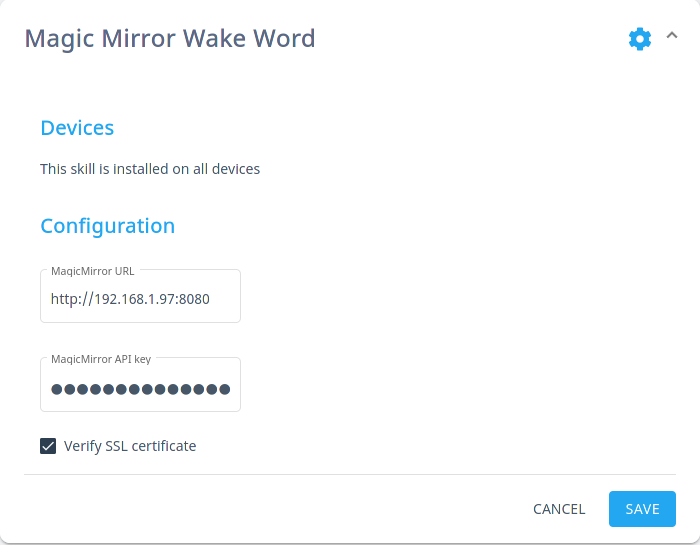

[](https://travis-ci.com/github/smartgic/mycroft-magicmirror-wakeword-skill) [](https://opensource.org/licenses/MIT) [](https://github.com/smartgic/mycroft-magicmirror-wakeword-skill/pulls) [](https://mycroft.ai) [](https://discord.gg/Vu7Wmd9j) 


#  MagicMirror² Wake Word

Image and message indicators Mycroft AI on MagicMirrot²

## About

[MagicMirror²](https://magicmirror.builders/) is an open source modular smart mirror platform. With a growing list of installable modules, the MagicMirror² allows you to convert your hallway or bathroom mirror into your personal assistant.

This skill interacts with MagicMirror² to let you know if Mycroft is listening. When a wake word is detected the an image and message are display on the screen and when the recording is done image and the message disappear.

## Examples

There is no example because there is no voice interaction with Mycroft AI.

## Installation

Make sure to be within the Mycroft `virtualenv` before running the `msm` command.

```
$ . mycroft-core/venv-activate.sh
$ msm install https://github.com/smartgic/mycroft-magicmirror-wakeword-skill.git
```

## Configuration

This skill utilizes the `settings.json` file which allows you to configure this skill via `home.mycroft.ai` after a few seconds of having the skill installed you should see something like below in the https://home.mycroft.ai/#/skill location:



Fill this out with your appropriate information and hit save.

## Credits

Smart'Gic

## Category

**IoT**

## Tags

#smartmirror
#magicmirror
#wakeword
#raspberrypi
#smarthome
#picroft
