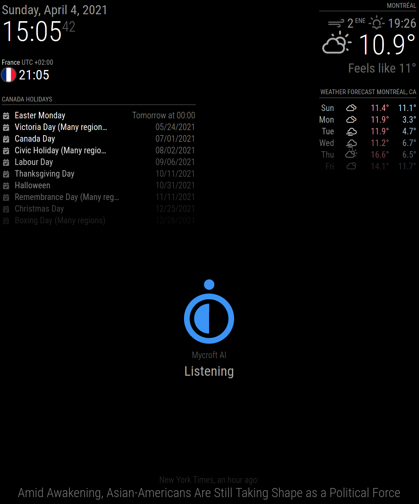

[](https://opensource.org/licenses/MIT) [](https://github.com/smartgic/skill-ovos-mm-wakeword/pulls) [](https://openvoiceos.org) [](https://discord.gg/Vu7Wmd9j)

#  MagicMirror² wake word detection

Display an image and a message on MagicMirror² when Open Voice OS is listening.

## About

[MagicMirror²](https://magicmirror.builders/) is an open source modular smart mirror platform. With a growing list of installable modules, the MagicMirror² allows you to convert your hallway or bathroom mirror into your personal assistant.

This skill interacts with MagicMirror² to let you know if OVOS is listening. When a wake word is detected an image and message are display on the screen and when the recording is done image and the message disappear.



## Example

There is no example because there is no voice interaction with Open Voice OS.

## Installation

```shell
$ pip install git+https://github.com/smartgic/skill-ovos-mm-wakeword
```

## Configuration

This skill utilizes the `~/.config/mycroft/skills/skill-ovos-mm-wakeword.smartgic/settings.json` file which allows you to configure this skill.

```json
{
  "url": "http://mm.home.lan",
  "key": "en323q9WBNMK3Q04WIPNEAsdfhesammhp44"
}
```

Fill this out with your appropriate information and save the file.

## MagicMirror configuration

In order to reach the `/ovos` route on your MagicMirror, you need to allow remote connections for a specific IP address or for a network range.

Please have a look here: https://github.com/smartgic/MMM-ovos-wakeword

## Credits

Smart'Gic

## Category

**IoT**

## Tags

#smartmirror
#magicmirror
#wakeword
#raspberrypi
#smarthome
